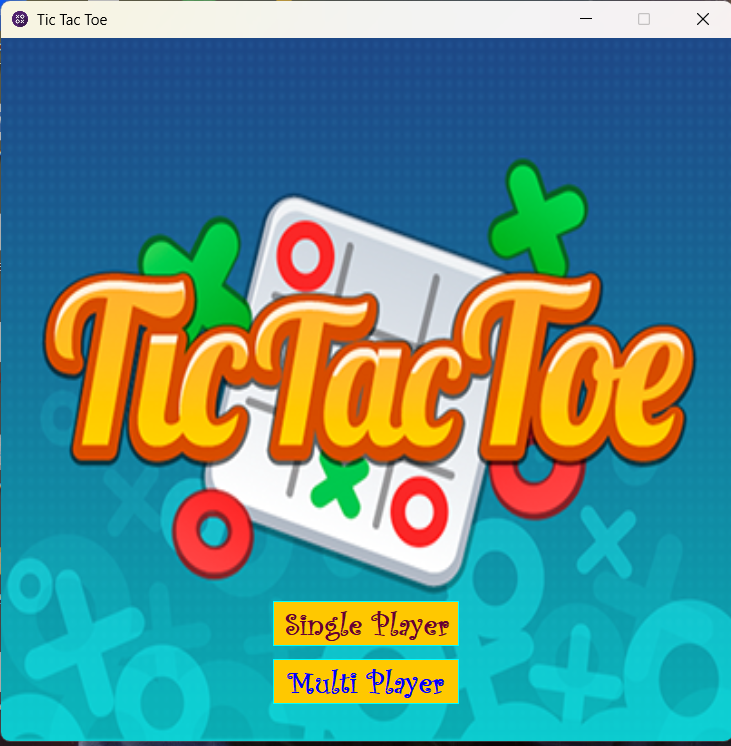
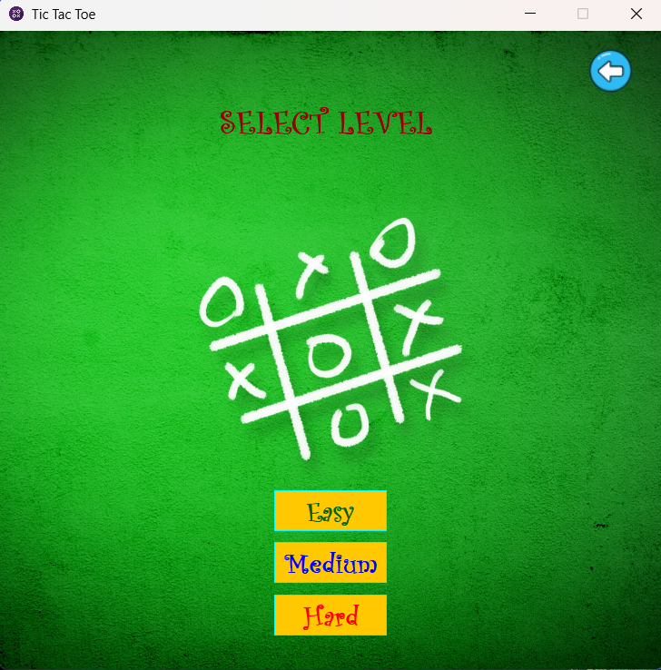
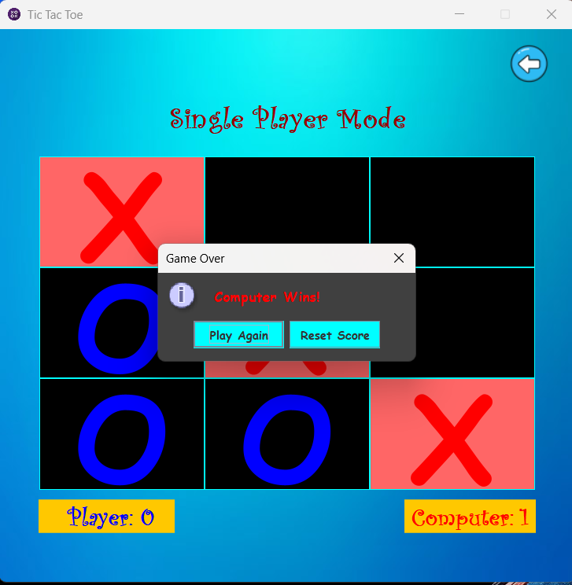

# Tic Tac Toe - Java Swing Application

This is a classic **Tic Tac Toe** game built with **Java Swing**. The project includes both **Single Player (with AI)** and **Two Player** modes, with different difficulty levels for AI Mode.

## 🕹️ Features                                                                                        

- **Single Player Mode** with AI Algorithm:                                                                      
  - Difficulty Levels: Easy, Medium, Hard
- **Two Player Mode** (Local Multiplayer)
- Simple and intuitive GUI built using **Java Swing**
- Clean and modular code structure

## ⬇️ Download Link
<a href="https://zt.ms/GkY" download>📥 tictactoesetup.exe</a>

## 🎨 Screenshots

### Main Menu

### Level Selection

### Gameplay

## ✅ Instructions

- Download the source files from `https://github.com/rakib-islam98/TicTacToeGame/tree/main/SourceCode` this repo.
- Organize it by folloing the project structure.
- Explore and modify the project as you like.
- Create a .jar file.
- Use launch4J and inno setup to deploy your project as exe file.

## 📂 Project Structure

- **TicTacToe/**
  - src/
    - tictactoegame *(Package name)*
    - MainMenu.java *(Main menu UI)*
    - LevelSelection.java *(Difficulty selection UI)*
    - TicTacToeMain.java *(Entry point (main method))*
    - SinglePlayerTicTacToe.java *(Handles single-player mode with AI)*
    - TicTacToe.java *(Core game logic)*
    - DifficultyEnumVariable.java *(Enum for difficulty levels)*
  - resource/
    - images/
        - BackButtonIcon.png
        - GameBackground.jpg
        - IconImage.png
        - LevelBackground.jpg
        - MainMenuBackground2.png
          
## 🙋‍♂️ Author
- Rakib Islam
